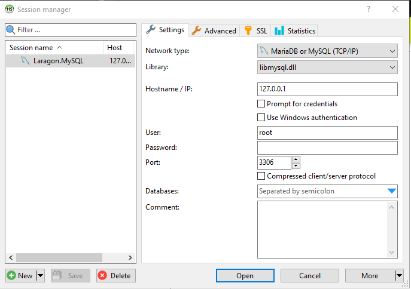

# instalasi


# instalasi aplikasi server

Seperti yang disinggung sebelumnya, untuk mempermudah porses installasi kita akan menggunakan aplikasi server laragon. ikuti langkah-langkah berikut:

1. Kunjungi halaman resmi Laragon pada [link berikut](https://laragon.org/download/)
2. pada bagian **Edition**, klik **Download Laragon - Full (173 MB)** untuk mengunduh aplikasi laragon.
3. setelah proses download selesai, double klik pada file **laragon-wamp.exe** untuk melakukan installasi.
4. klik **Next** dan **Install** sampai selesai, lalu klik **Finish**
5. pada jendela aplikasi laragon yang terbuka, klik Start All untuk menjalankan server web dan database.
6. cukup klik tanda ++x++ untuk me-minimze aplikasi laragon.

# mengunduh aplikasi

untuk mengunduh aplikasi ini lakukan langkah-langkah berikut:

1. Kunjungi halaman release aplikasi pada [link berikut](https://github.com/masipnu/apg/releases/tag/v1.0)
2. unduh kode sumber dalam format ZIP dengan klik `Source code(zip)` pada bagian Assets.
3. Anda akan mendapatkan file `apg-1.0.zip`.
4. Ekstrak file tersebut pada direktori `C:\laragon\www`.
5. Anda akan mendapati direktori `apg-01`, silahkan rename menjadi `apg`.

# instalasi database

Karena aplikasi ini bekerja menggunakan database maka kita perlu mengatur databasenya terlebih dahulu sebelum dijalankan.


1. Buka aplikasi laragon.
   
2. klik `database` untuk membuka aplikasi manajemen database Heidi Sql.
  
3. Biarkan bagian password (kosong), lalu klik **Open**
   
4. saat jendela Heidi SQL terbuka, klik menu `File` > `Run SQL file`, lalu arahkan ke file `apg.sql` yang berada di direktori `C:laragon\www\apg\database` dan klik **Open**, jika ada peringatan, klik **Yes**.
5. Selama tidak ada pesan `Error`,berarti database sudah tersedia.
6. Tekan tombol ++f5++ pada jendela Heidi SQL untuk me-refresh database,maka anda akan menemukan database `apg` lengkap dengan struktur tabel beserta contoh datanya.
7. Sekarang anda bisa menutup aplikasi Heidi SQL dan me-minimize Laragon.


# konfigurasi aplication

Setelah mengatur database, kita perlu melakukan konfigurasi pada aplikasi APG.
Ikuti langkah-langkah berikut.

1. Buka file `config.[php]` pada direktori `C:laragon\www\apg\library` dengan teks editor. bisa Visual studio code atau Notepad.
2. Atur Konfigurasi user dan password database pada baris berikut. 
```php
<?php
$host = "localhost";
$user = "root";
$pass = "";
$db = "apg";

$con = mysqli_connect($host, $user, $pass, $db);

if (mysqli_connect_errno()) {
    echo "Koneksi gagal! : " . mysqli_connect_error();
}
?>
```
3. karena pada user root tidak perlu memakai password, maka saya ubah `$user = "root";` menjadi `$user = ""`.
4. Cukup ini saja dan aplikasi manajemen siap dijalankan
